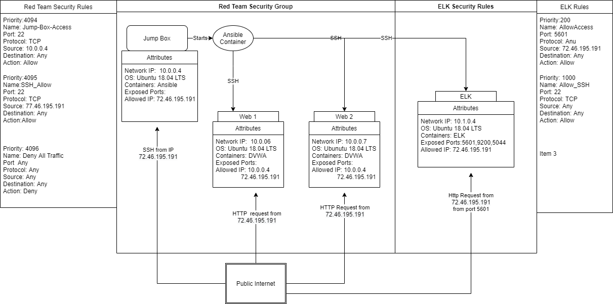
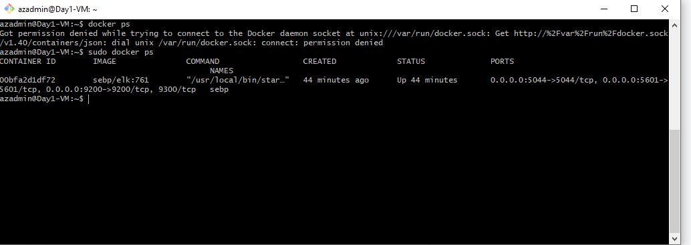

## Automated ELK Stack Deployment

The files in this repository were used to configure the network depicted below.



These files have been tested and used to generate a live ELK deployment on Azure. They can be used to either recreate the entire deployment pictured above. Alternatively, select portions of the YML file may be used to install only certain pieces of it, such as Filebeat.

  
  ```YML
  ---
  - name: Config ELK VM with docker
    hosts: elk
    become: true
    tasks:
    - name: docker.io
      apt:
        name: docker.io
        state: present
    - name: pip3
      apt:
        name: python3-pip
        state: present
    - name: Docker module
      pip:
        name: docker
        state: present
    - name: set vm.max_map_count to 262144 in sysctl
      sysctl: name={{ item.key }} value={{ item.value }}
      with_items:
        - { key: "vm.max_map_count", value: "262144" }
    - name: download and launch a docker web container
      docker_container:
        name: sebp
        image: sebp/elk:761
        state: started
        restart_policy: always
        published_ports:
          - 5601:5601
          - 9200:9200
          - 5044:5044
```

```YML
---
- name: Configure Elk VM with Docker
  hosts: webservers
  become: true
  tasks:
  - name: Install filebeat
    command: curl -L -O https://artifacts.elastic.co/downloads/beats/filebeat/filebeat-7.6.1-amd64.deb
  - name: Download deb
    command: sudo dpkg -i filebeat-7.6.1-amd64.deb
  - name: FILEBEAT - Copy base filebeat config file
    copy: src=/etc/ansible/files/firebeat-configuration.yml dest=/etc/filebeat/filebeat.yml
  - name: Filebeat Command run
    command: sudo filebeat modules enable system
  - name: FileBeat setup
    command: sudo filebeat setup
  - name: FileBeat go
    command: service filebeat start
  - name: Install Metric Beat
    command: curl -L -O https://artifacts.elastic.co/downloads/beats/metricbeat/metricbeat-7.4.0-amd64.deb
  - name: Metricbeat DPKG
    command: dpkg -i metricbeat-7.4.0-amd64.deb
  - name: Config MetricBeat
    copy: src=/etc/ansible/files/metricbeat-config.yml dest=/etc/metricbeat/metricbeat.yml
  - name: Metricbeat Module
    command: metricbeat modules enable docker
  - name: metricbeat setup
    command: metricbeat setup
    name: metric go
    command: service metricbeat start
```


This document contains the following details:
- Description of the Topologu
- Access Policies
- ELK Configuration
  - Beats in Use
  - Machines Being Monitored
- How to Use the Ansible Build


### Description of the Topology

The main purpose of this network is to expose a load-balanced and monitored instance of DVWA, the D*mn Vulnerable Web Application.

Load balancing ensures that the application will be highly reliable, in addition to restricting traffic to the network.
- Load Balancers redistribute traffic to seperate servers, thus not allowing one server to be overloaded. This is critical when a DDOS attack
hits the server.
- The Jump Box Server provides an easy way to update applications on multiple servers. It also allows easy restricting of what applications can
be allowed on the servers by management on the Jump Box Server.

Integrating an ELK server allows users to easily monitor the vulnerable VMs for changes to the services and system logs.
- Filebeat monitors logs specified and forwards them to ElasticSearch or LogStash for indexing.
- MetricBeat collects metrics of services running on the server and forwards the info to ElasticSearch or LogStash for indexing.

The configuration details of each machine may be found below.
| Name     | Function            | IP Address | Operating System |
|----------|---------------------|------------|------------------|
| Jump Box | Gateway             | 10.0.0.4   | Linux            |
| Web-1    | Hosts Web Server    | 10.0.0.6   | Linux            |
| Web-2    | Hosts Web Server    | 10.0.0.7   | Linux            |
| ELK      | Monitors Web Server | 10.1.0.4   | Linux            |

### Access Policies

The machines on the internal network are not exposed to the public Internet. 

Only the Jump Box machine can accept connections from the Internet. Access to this machine is only allowed from the following IP addresses:
- 72.46.195.191

Machines within the network can only be accessed by Jump Box.
Although the Elk Machine can have access from 72.46.195.191 through port 5601.

A summary of the access policies in place can be found in the table below.

| Name       | Publicly Accessible | Allowed IP Address |
|------------|---------------------|--------------------|
| Jump Box   | Yes                 | 72.46.195.191      |
| Web-1      | No                  | 10.0.0.6           |
| Web-2      | No                  | 10.0.0.7           |
| ELK Server | Yes                 | 72.46.192.191      |

### Elk Configuration

Ansible was used to automate configuration of the ELK machine. No configuration was performed manually, which is advantageous because
we can limit what services can be run and updating is much simpler than updating each machine manually.

The playbook implements the following tasks:
-Download docker.io
-Downloads python 3
-Sets Virtual Memory allocation usage with `systemtl` to the value `262144`
-Download the docker container and sets the exposed ports to `5601` `9200` `5044`

The following screenshot displays the result of running `docker ps` after successfully configuring the ELK instance.



### Target Machines & Beats
This ELK server is configured to monitor the following machines:
- Web-1 (10.0.0.6)
- Web-2 (10.0.0.7)

We have installed the following Beats on these machines:
- FileBeat
- MetricBeat

These Beats allow us to collect the following information from each machine:
- FileBeats collects system logs
- MetricBeats collects metrics of services running

### Using the Playbook
In order to use the playbook, you will need to have an Ansible control node already configured. Assuming you have such a control node provisioned: 

SSH into the control node and follow the steps below:
- Copy the filesbeat-configuration file to /etc/ansible/files.
- Update the hosts file to include
```
[elk]
10.1.0.4 ible_python_interpreter=/usr/bin/python3
```
- Run the playbook, and navigate to `http://[Elk Server Public IP]:5601/app/kibana` to check that the installation worked as expected.


